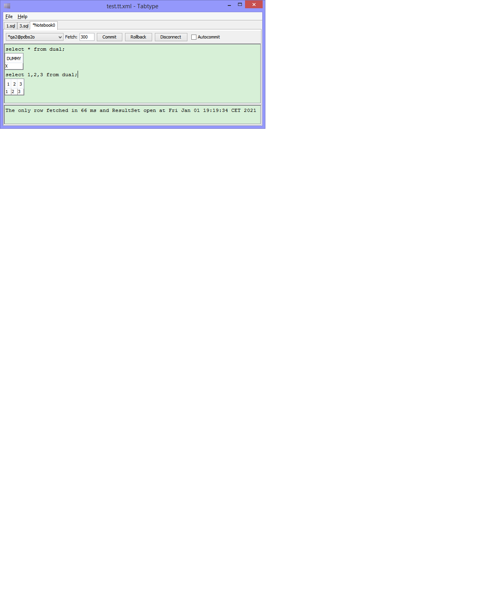

# Tabtype

Pathetically simple Swing front-end for JDBC queries.

This follows the "notebook" idea, in which queries and results
are shown in the same buffer.

All of it is sort of hackish and serving an immediate need I have
right now.

See the README [here](src/main/resources) for usage instructions.

## Invocation

The tool builds as modular JAR and can be started up without arguments. However, to be of any practical use, it is necessary to put JDBC drivers on the module path, and specify properties and other files on the command line as detailed in the README mentioned above.

An example command line is:

  java -XX:+UseSerialGC \
    -Dfile.encoding=Cp1252 \
    -Dswing.defaultlaf=com.sun.java.swing.plaf.windows.WindowsLookAndFeel \
    -p $HOME/.m2/repository/com/oracle/ojdbc7/12.1.0.1/ojdbc7-12.1.0.1.jar \
    -jar tabtype.jar \
    -logconfig $APPDATA/tabtype/logging.properties \
    -config $APPDATA/tabtype/tabtype.properties.xml \
    -config $APPDATA/tabtype/tabtype.properties \
    $HOME/Documents/workspace.tabtype

This example uses the serial GC, which is a recommendation for desktop applications, sets a default encoding for text files, and uses the Windows L&F.

There is also an example of a launcher program for Windows in the repository. Using a wrapper such as this, many of the above arguments don't need to be repeated when running the program, which makes it easier to configure it for file type associations.